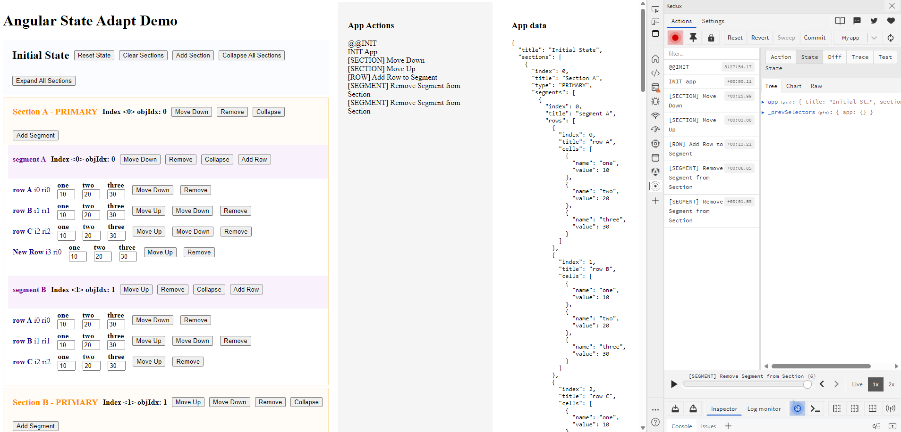

# stackblitz-angular-state-adapt-demo

[MAIN BRANCH: Edit in StackBlitz next generation editor ⚡️](https://stackblitz.com/~/github.com/kingjordan/stackblitz-angular-state-adapt-demo)

[STATE-ADAPT BRANCH: Edit in StackBlitz next generation editor ⚡️](https://stackblitz.com/~/github.com/kingjordan/stackblitz-angular-state-adapt-demo/tree/state-adapt)

## Description

This repo tests managing a deeply nested app state with state-adapt in an angular app.  The goal is to explore best practices and to keep the solution as declariative as possible.

**Main branch** holds the basic working angular app without any state managment or interactivity

**State-adapt** branch holds the refactored app with state and interactivity

There is an **app action** section that logs state actions to the screen.

The **app data** section shows the underlying state tree with live changes

